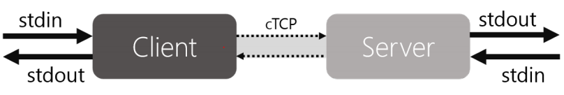
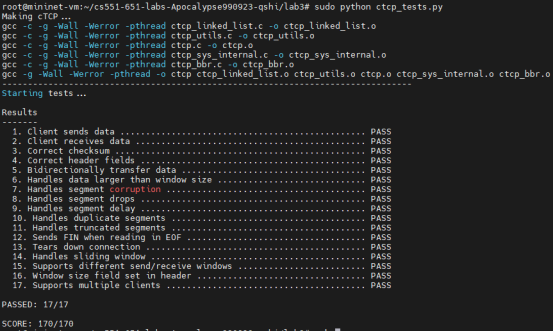
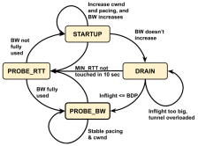
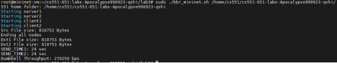
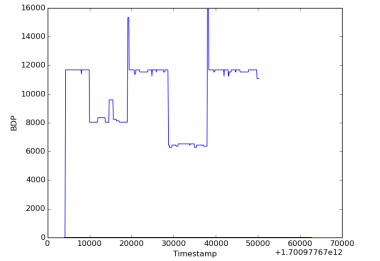
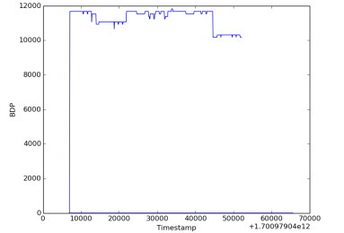
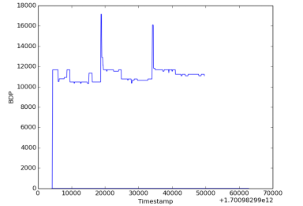

# cTCP-with-BBR-algorithm
CS551 Lab3
# Part 1

In Part1 , I implemented the logic of cTCP with required functionality of In-order delivery, Multiple clients and Sliding window.

For better maintenance of the TCP transmit-receive window, I created two data structures to separately represent these two states:
* `send_state_t`: records transmission state of the current TCP connection, including the last received ACK number from the other side, the last byte read from input, the last byte sent, whether I have read an EOF or error from input, and a linked list to store the segments that have been sent but not ACKed yet(for convenience I call it unacknowledged_list in the rest of report).
* `receive_state_t`: records receiving state of the current TCP connection, including the last sequence number I received, the statistics of corrupted segments(Truncated, out of receive_window and invalid checksum) I received since TCP connection is established, whether I received FIN from the other side and a linked list to store the segments that I received inside the range of current receive_window but not been outputted yet(for convenience I call it unoutputted_list in the rest of report).
* `to_send_ctcp_segment_t`: More specifically, in order to keep track of the segment I send, I also write this new data structure, which wraps a ctcp_segment_t inside, and adds two more fields to record the last time segment was sent and how many times this segment already been sent.

In addition, I added several helper functions to make code more clearer and cleaner:
* `void ctcp_send(ctcp_state_t *)`: is called at the end of ctcp_read(), and will send the segments stored in unacknowledged_list as many as much possible, as long as which are in the current transmit window.
* `void ctcp_send_segment(ctcp_state_t *, to_send_ctcp_segment_t *)`: set the remaining fields of the specific segment and sends it using conn_send().
* `void ctcp_send_ack_segment(ctcp_state_t *)`: send the ACK segment to the other side with no data payload. The segment just contains control messages, indicating the last byte received and the current window size.
* `void clean_list(linked_list_t *)`: clean out the entire list with every object freed.
* `void clean_acked_segments(ctcp_state_t *)`: clean all the segments in unacknowledged_list which are already been acknowledge by the other side.

Tested the code with tester ctcp_tests.py

# Part2
In Part2, I wrote code to incorporate the BBR Congestion Control Algorithm on the basis of cTCP implementation in Part1, which utilizes the Bandwidth-Delay Product as indicator of congestion condition, estimated by dynamic min_RTT and max_BW during the transmission.

To implement BBR, the main work is inside ctcp_bbr.h and ctc_bbr.c files. In ctcp_bbr.h, I defined the bbr structure which contains field needed for storing information of current BBR states, including:
* `mode`: current mode among all four BBR states
* `rt_prop`: estimated min_RTT in millisecond
* `btlbw`: estimated max_BW, whose unit is bit/sec.
* `num_rtt`: number of RTTs since the connection established
* `min_rtt_stamp`: timestamp when min_RTT was last updated
* `probe_rtt_done_stamp`: expected timestamp for the end of BBR_PROBE_RTT mode 
* `next_packet_send_time`: expected next packet send timestamp
* `cycle_idx`: index of the current gain cycle of BBR_PROBE_BW mode
* `cycle_start_time`: timestamp when the current PROBE mode cycle started
* `cur_pacing_gain`: tracks the current pacing gain value
* `cur_cwnd_gain`: tracks the current cwnd gain value
* `full_bw_cnt`: number of rounds without BW growth, which may indicates full pipe

More Specifically, for btlbw, I introduced the `minmax_sample` structure from linux kernel, which I think is useful for storing and update maximum bandwidth samples.

Also I defined the `bbr_init()` function to initialize the bbr structure, and `check_bbr_state()` function to keep checking and updating the BBR state during transmission, for which I wrote implementation in ctcp_bbr.c.

The design logic for check_bbr_state() I wrote is the core component of BBR algorithm, which basically followed the instructions and operated the switching of states as the graph shown below.

And let me explain what my codes did in each BBR phase:
* `BBR_STARTUP`: set high pacing gain and cwnd gain to quickly fill pipe (like slow-start). If reached max_BW estimate plateaus, then switch to BBR_DRAIN mode
* `BBR_DRAIN`: set low pacing gain to drain the queue created in STARTUP stage until the size of inflight data is smaller than estimated BDP, then switch into BBR_PROBE_BW mode
* `BBR_PROBE_BW`: keep cycling pacing_gain to explore and fairly share bandwidth. Here I wrote a helper function bbr_is_next_cycle_phase() to judge whether it’s appropriate to go to the next PROBE_BW cycle, based on the time difference between current time and recent cycle start time, as well as comparing inflight data volume with estimated BDP
* `BBR_PROBE_RTT`: occasionally send slower to probe min RTT. I have to mention that All the other three states will fall into BBR_PROBE_RTT mode as long as min_RTT keeps untouched over 10 sec. And the BBR_PROBE_RTT mode will keep running for 200ms, then it will be switched back to either BBR_STARTUP or BBR_PROBE_BW depending on whether full BW reached

In addition, I made a little modification of cTCP on ctcp.c in order to enable BBR functionality.

In terms of data structures, I separated the `unacked segments` link list into `new segments to be sent` and `retransmit segments`, as re-sending segments are involved in our BBR process. Also I added some fields in ctcp_state which are useful for BBR, including `inflight data size`, `app_limited_until`(decides whether under app_limit region), `last packet send timestamp` and `last packet sent size`.

And I made primary work on the function `ctcp_send()` and `clean_acked_segments()`, which is called by ctcp_receive(). In `ctcp_send()`, besides re-sending old segments, for incoming segments, the send rate is controlled by conditions of inflight data upper limit and next packet send time. On the other hands, if there's no new segments, then set `app_limit_until = inflight`. After sending each segment, we increase the inflight, as well as set the `next packet send time = now + segment size / (pacing gain * max_BW)`.

In `clean_acked_segments()`, I calculated the sample rtt based on the current time and the timestamp when segment was last sent, as well as the sample bandwidth with rtt and segment length. The min_RTT and max_BW were updated by sample rtt and sample bw. More specifically, if bw is not increasing, then do the increment of full_bw_cnt. Also, inflight and app_limit_until should be reduced. And `check_bbr_state()` is called to check and update the BBR state based on the latest sample statistics.

Tested BBR-CTCP on dumbbell topology, by running `lab3_topology.py` and script `bbr_mininet.sh`.

Also did the test on I2 topology. These are the three results of BDP plot executed by bbr_i2.sh.

How to Build
-------------------------------------

To build, run:

  make

To clean, run:

  make clean

Running a Server with a Single Client
-------------------------------------
To run a client at port 9999 that connects to a server on the same machine at
port 8888, first run the command to start the server:

    sudo ./ctcp -s -p 8888

Then start the client:

    sudo ./ctcp -p 9999 -c localhost:8888

You can connect many clients to the server. The server will output all of the
received data from the clients to the same STDOUT (resulting in interleaved
output). If the server replies to the clients, it will send only to the most
recently connected client.

Larger Window Sizes
-------------------
To run a client with a window size multiple of 2
(2 * MAX_SEG_DATA_SIZE = 2880 bytes), do the following:

    sudo ./ctcp -p 9999 -c localhost:8888 -w 2

Connecting to a Web Server (Part 1a)
------------------------------------
You can also run a client at port 9999 that connects to a web server at Google.
Note that you usually need to prepend the website with "www", and web servers
are generally found at port 80:

    sudo ./ctcp -p 9999 -c www.google.com:80

After you have connected, you can get the homepage by typing in the following.
Make sure you press enter after each line (e.g. after "GET / HTTP/1.1" you press
enter so "Host: .." is on a new line. That means you should not copy and paste
this but actually type it into the console).

    GET / HTTP/1.1
    Host: www.google.com
    [press enter]

Or, maybe you want to get the services page:

    GET /services/ HTTP/1.1
    Host: www.google.com
    [press enter]

Some sites we suggest testing with include google.com and bing.com. This may
not work on many websites since they require more complicated HTTP headers.

Note: If you connect to a server with e.g. port 10000, disconnect, and try to
reconnect again, it may not work for various reasons. Try connecting again with
a port number you have not used yet or waiting for a few seconds.

Running Server with Application and Multiple Clients (Part 1b)
--------------------------------------------------------------
To run a server that also runs an application, run the following command.
Each client that connects to the server will be associated with one instance
of the application (refer to the diagram for Lab 2).

    sudo ./ctcp -s -p 9999 -- sh

The server will start a new instance of the application each time a new client
connects. For example, to start two clients, which will start two instances
of an application on the server, do:

    sudo ./ctcp -c localhost:9999 -p 10000
    sudo ./ctcp -c localhost:9999 -p 10001

To run a server that runs an application with arguments, run the following
command:

    sudo ./ctcp -s -p 9999 -- grep --line-buffered "hello"
    sudo ./ctcp -s -p 9999 -- ./test

Any arguments after -- will be treated as application arguments, the first
one being the application name.

*Fun Fact* grep needs to be run with the --line-buffered flag because it
queues up its input until an EOF is read. With this flag, it can respond
after every newline.

Unreliability
-------------

The following flags can be used to create an unreliable stream:

  --drop <drop percentage>
  --corrupt <corrupt percentage>
  --delay <delay percentage>
  --duplicate <duplicate percentage>

This drops 50% of all segments coming out from this host. Unreliability must
be started on both hosts if desired from both ends.

  sudo ./ctcp -c localhost:9999 -p 12345 --drop 50

Large Binary Files
------------------
MAKE SURE you use these options carefully as they will overwrite the contents
of the file.

ctcp-client1> sudo ./ctcp [options] > newly_created_test_binary
ctcp-client2> sudo ./ctcp [options] < original_binary